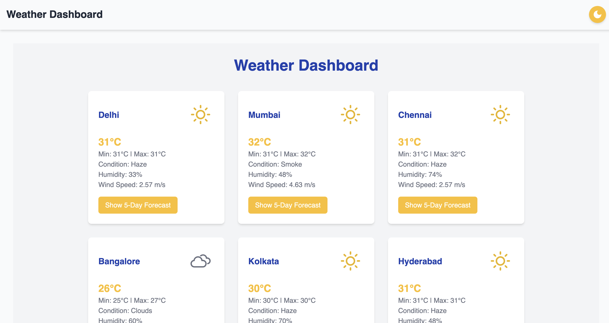
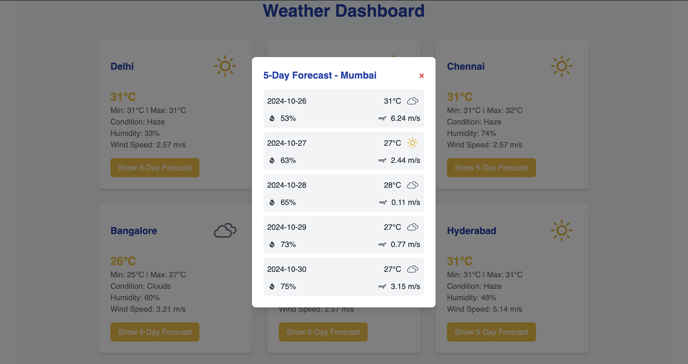
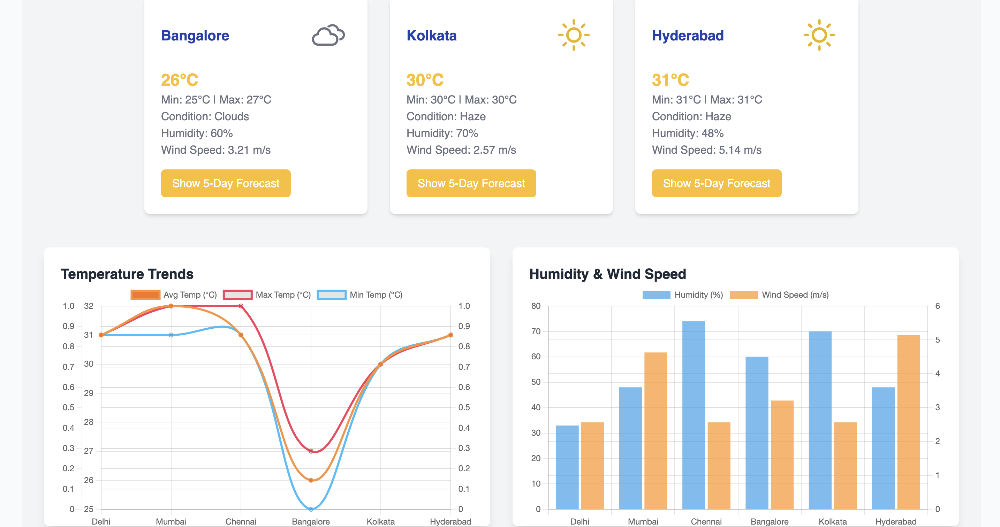

# Weather Dashboard Application 🌦️

## Project Overview
This project is a Weather Monitoring Dashboard that provides real-time weather data, 5-day forecasts, and visual insights such as temperature trends, humidity, and wind speed. The dashboard also supports light and dark mode themes, with smooth transitions and interactive charts to visualize weather data dynamically.

It covers all requirements, including bonus points with features such as:

- Real-time weather summaries using the OpenWeatherMap API
- 5-day weather forecasts displayed elegantly
- Humidity and wind speed charts with independent Y-axes (BONUS)
- Dark/Light mode switching 🌙🌞 (EXTRA)
- Interactive temperature charts with zoom and pan functionality (EXTRA)
- Loader animations for a smooth user experience during data fetching (EXTRA)


## Table of Contents
- [Screenshots](#screenshots)
- [Technologies Used](#technologies-used)
- [Features](#features)
- [Setup Instructions](#setup-instructions)
- [Application Flow](#application-flow)
- [Future Work](#future-work)


## Screenshots
HomePage




## Technologies Used

### Frontend
- **React**: Component-based architecture for a responsive and modular UI
- **Tailwind CSS**: For styling the app with dark/light themes and custom UI components
- **Chart.js & react-chartjs-2**: For interactive data visualizations and trend analysis
- **React Icons**: For stylish icons, including theme toggles

### Backend
- **Express.js**: Handles API routes and serves weather data from OpenWeatherMap
- **Axios**: For making HTTP requests to the weather API
- **CORS**: To handle cross-origin requests between backend and frontend

## Features

### 1. Real-Time Weather Summaries
- Provides current temperature, max/min temperature, and dominant weather condition for multiple cities
- 5-day forecast displayed elegantly in a modal view with independent charts for temperature, humidity, and wind speed

### 2. Interactive Charts with Zoom and Pan
- **Temperature Chart**: Displays average, max, and min temperatures with zoom and pan capabilities
- **Humidity & Wind Speed Chart**: Displays data on independent Y-axes for better readability

### 3. Dark/Light Mode Toggle 🌙🌞
- Users can switch between dark and light modes
- The selected theme is persisted in localStorage and applied on reload

### 4. Loader Animation
- A stylish loader animation is shown while data is being fetched from the backend

## Setup Instructions

### Prerequisites
- Node.js installed on your machine
- An API key from OpenWeatherMap (free sign-up required)

### Step 1: Clone the Repository
```bash
git clone <repository-url>
cd weather-dashboard
```

### Step 2: Install Dependencies
Install backend dependencies:
```bash
cd backend
npm install
```

Install frontend dependencies:
```bash
cd frontend
npm install
```

### Step 3: Configure the Backend
Replace the API key in weatherController.js:
```javascript
const apiKey = 'YOUR_API_KEY';  // Replace with your API key
```

### Step 4: Start the Backend Server
```bash
cd backend
node server.js
```

### Step 5: Start the Frontend Application
```bash
cd frontend
npm run dev
```

### Step 6: Access the Application
Open your browser and visit:
http://localhost:5173

## Application Flow

1. HomePage
   - Displays a summary of real-time weather data with charts and trend analysis

2. Theme Toggle
   - Allows users to switch between dark and light modes, with a smooth transition

3. Weather Charts
   - **Temperature Chart**: Shows average, max, and min temperatures
   - **Humidity & Wind Speed Chart**: Independent Y-axes for better comparison

4. Loader Animation
   - Displayed when data is being fetched from the backend

5. 5-Day Forecast
   - Accessible via a modal that presents detailed weather data for upcoming days


## Future Work

1. Add User Authentication
   - Allow users to log in and personalize city preferences

2. Geolocation Support
   - Automatically detect user location and show relevant weather data

3. Mobile-Responsive Enhancements
   - Optimize the UI further for mobile devices

4. Push Notifications
   - Send weather alerts and forecast updates

5. Weather Alerts
   - Add alerts for extreme weather conditions (e.g., heatwave or storm warnings)

## Conclusion
This Weather Dashboard app is a fully functional, modern weather monitoring system. With the added dark/light mode toggle, loader animation, interactive charts, and 5-day forecasts, it offers a rich and responsive user experience.

All bonus features have been implemented, including:
- Zoom and pan capabilities on charts
- Independent Y-axis scaling for humidity and wind speed
- A theme toggle feature with smooth transitions between light and dark modes

Thank you for exploring the Weather Dashboard! 🌦️ If you have any suggestions or feedback, feel free to reach out. 🎉
